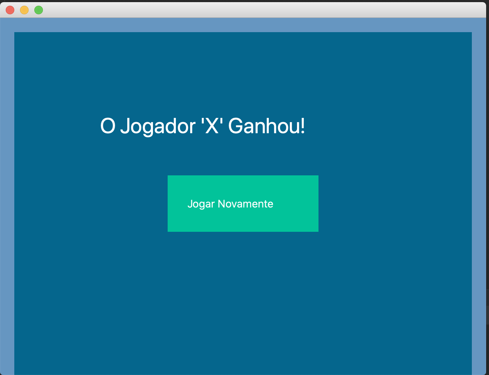
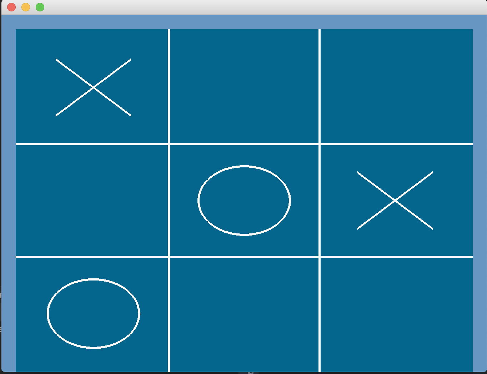

# TicTacToe

Tic tac toe game developed in Python with OpenGL and QT

# Home screen

# Game screen

# Running the code:

**Install dependencies:**
~$ pip install -r requirements.txt

**Running:**
~$ python main.py
